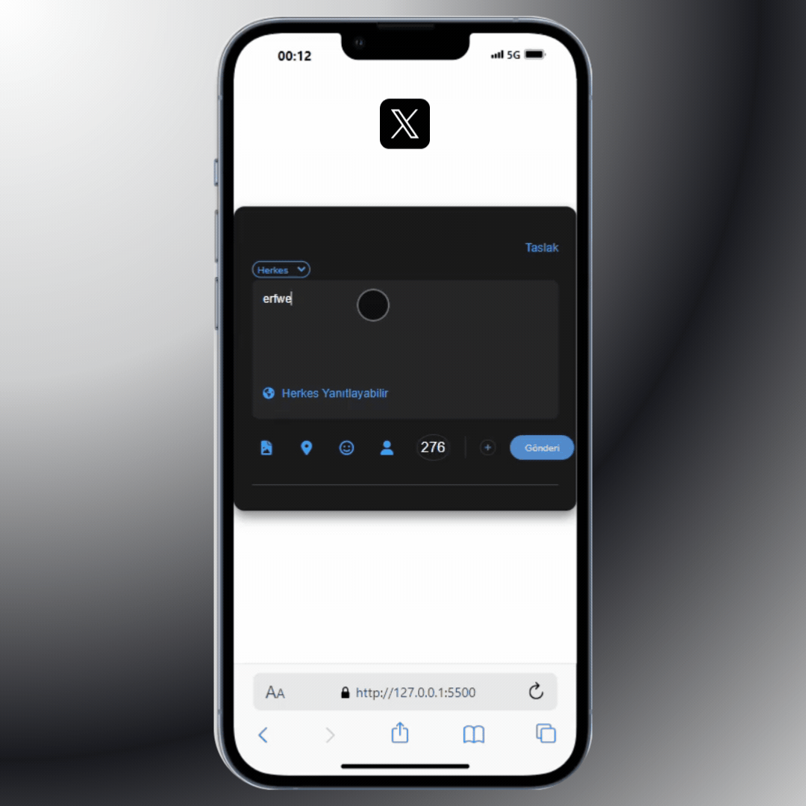

# 🅧 X Uygulaması- X Gönderi Oluşturma Arayüzü 🅧

Bu projede, eski adıyla Twitter yeni adıyla X uygulamasının gönderi oluşturma kartı arayüzü oluşturmak için HTML, CSS ve JavaScript kullanıldı. 
Kullanıcılar, gönderi yazabilir ve karakter sınırını gözeterek göndermek için bir kullanıcı arayüzü sunar. Ayrıca karakter sınırının aşılması durumunda premium basic teklifi yapılması otomatik aktif edildi.

## 💼 Sunum

## 📚 Özellikler

- **🖊️ Gönderi Girişi: Kullanıcılar gönderisini yazabilir.
- **🔄 Karakter Sınırı: 280 karakter sınırı vardır ve karakter sayacı ile takip edilmesini sağlar.
- **🌍 Gizlilik Ayarları: Basit gizlilik ayar simgeleri (örneğin, dünya ikonu).
- **🎈 Emoji ve İkonlar: Font Awesome entegrasyonu ile ikonlar ve emoji desteği.

## 📝 Yapılanlar

- **🎨 Kullanıcı input'a tıkladığında placeholder'ın renginin değişmesi
- **✨ Klavyeden giriş olduğunda placeholder'ın kaybolması
- **🔄 Klavyeden giriş yapılmadığında placeholder'ın tekrar gelmesi
- **✅ Eğer klavye girişi varsa gönderi butonunun aktif olması
- **🚫 Eğer kullanıcı limiti geçmişse gönderi butonunun pasif olması
- **💎 Eğer kullanıcı limiti geçmişse ekranın herhangi bir yerine basmadan otomatik 
       premium basic teklifi yapılmasının otomatik aktif edilmesi.

### 🔧 Kullanılan Teknolojiler

- **🎨 CSS ve HTML
- **🧠 JavaScript

